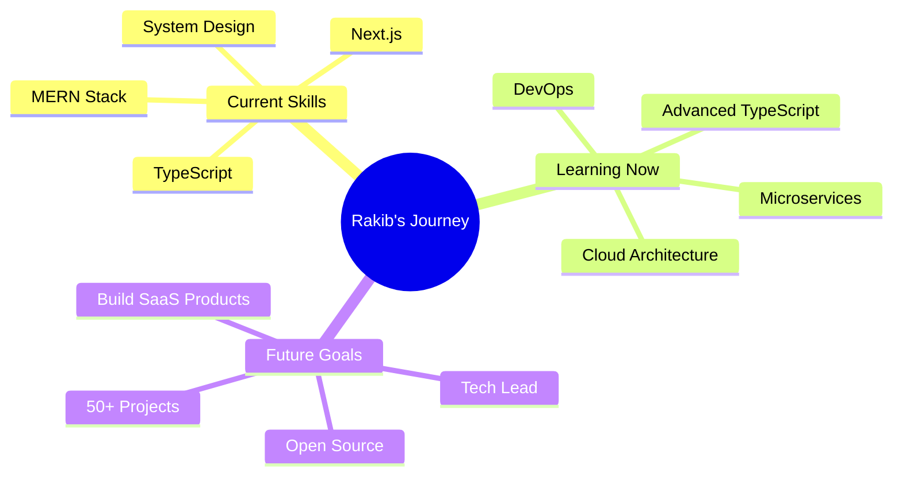

<!-- Animated Header -->
<div align="center">
  


<p align="center">
  
</p>

[](https://portfolio-rh-rakib04.vercel.app)
[](https://linkedin.com/in/rh-rakib04)
[](mailto:rakibulhossain.dev@gmail.com)
[](https://github.com/rh-rakib04)

</div>

---

## 🚀 About Me


I'm a **Full-Stack Developer** from **Chattogram, Bangladesh** 🇧🇩, passionate about creating efficient, user-centered web applications. Currently pursuing my **BBA** while building production-ready applications using modern JavaScript frameworks.

- 🔭 I'm currently working on **Full-Stack Web Applications**
- 🌱 I'm learning **Advanced TypeScript, System Design & Cloud Architecture**
- 💼 Open for **Full-time positions** and **Freelance projects**
- 💡 I believe in **"Consistency over intensity. Systems over motivation."**
- 📍 Based in **Chattogram, Bangladesh**
- 🎯 **2024 Goal:** Contribute to Open Source & Build 50+ Projects

```javascript
const rakib = {
  location: "Chattogram, Bangladesh 🇧🇩",
  role: "Full-Stack Developer",
  education: "BBA Student with Engineering Mindset",
  code: ["JavaScript", "TypeScript", "Python"],
  technologies: {
    frontend: ["React", "Next.js", "Redux", "TailwindCSS"],
    backend: ["Node.js", "Express", "MongoDB", "Firebase"],
    tools: ["Git", "Postman", "Figma", "VS Code", "Vercel"]
  },
  architecture: ["Microservices", "Event-Driven", "RESTful APIs"],
  currentFocus: "Building Scalable & Maintainable Applications",
  philosophy: "Write code that speaks for itself"
};
```


## 🛠️ Tech Stack & Tools

<div align="center">

### 💻 Frontend Development


### ⚙️ Backend Development


### 🔧 Tools & Platforms


</div>


## 🏆 Featured Projects

<div align="center">

<a href="https://github.com/rh-rakib04/rentwheels-client">
  
</a>
<a href="https://github.com/rh-rakib04/eTutionBd_Client">
  
</a>

</div>

### 🚗 [RentWheels - Car Rental Platform](https://github.com/rh-rakib04/rentwheels-client)
> A comprehensive full-stack car rental application with real-time booking management and payment integration.

**Tech Stack:** React · Node.js · Express · MongoDB · Stripe · JWT  
**Key Features:**
- 🔐 Secure JWT-based authentication & authorization
- 📅 Real-time booking system with availability tracking
- 💳 Integrated payment processing with Stripe
- 👨‍💼 Admin dashboard for fleet and booking management
- 📱 Fully responsive design across all devices

**Impact:** Streamlined rental process reducing booking completion time by **40%**

---

### 📚 [eTuitionBD - Online Tutoring Marketplace](https://github.com/rh-rakib04/eTutionBd_Client)
> Smart platform connecting students with qualified tutors through intelligent matching algorithms.

**Tech Stack:** MERN Stack · Firebase Auth · TailwindCSS · Socket.io  
**Key Features:**
- 🎯 AI-powered tutor matching based on subject and preferences
- 💬 Real-time chat and video call integration
- 📊 Performance tracking and progress analytics
- 🔔 Smart notification system
- 📱 Mobile-first responsive design

**Impact:** Improved student-tutor connection success rate by **60%**


## 📊 GitHub Statistics

<div align="center">
  


</div>

### 🏆 GitHub Trophies
<div align="center">
  


</div>

### 📈 Contribution Graph
<div align="center">
  


</div>

### 🐍 Contribution Snake
<div align="center">
  


</div>


## 💼 What I Bring to Your Team

<div align="center">

| 💪 Strength | 📝 Description |
|-------------|----------------|
| **🎯 Production-Ready Code** | Writing clean, maintainable, and scalable solutions that stand the test of time |
| **🔄 Full-Stack Expertise** | End-to-end development from database design to deployment and monitoring |
| **🧩 Problem-Solving Mindset** | Breaking down complex challenges into actionable, efficient solutions |
| **📚 Continuous Learning** | Daily commits, constant growth, and quick adaptation to new technologies |
| **🤝 Team Collaboration** | Clear communication, code reviews, and a teamwork-oriented approach |
| **⚡ Performance Focus** | Optimizing applications for speed, scalability, and user experience |

</div>


## 🎯 Current Focus & Goals

<div align="center">



</div>

- 🔨 **Building:** Production-grade applications with Next.js 14 and TypeScript
- 📚 **Learning:** Advanced system design patterns and cloud architecture (AWS/Azure)
- 🌱 **Contributing:** Actively seeking open-source projects to contribute to
- 💡 **Exploring:** Microservices architecture and serverless computing
- 🎯 **Goal 2024:** Build and deploy 50+ projects, contribute to 10+ open-source repos


## 📫 Let's Connect & Collaborate

<div align="center">

I'm always excited to discuss new opportunities, collaborate on innovative projects, or connect with fellow developers and tech enthusiasts!

### 💼 Open For:
✅ Full-time Developer Positions  
✅ Freelance & Contract Projects  
✅ Open Source Collaborations  
✅ Technical Consulting  

<br>

[](https://linkedin.com/in/rh-rakib04)
[](https://portfolio-rh-rakib04.vercel.app)
[](mailto:rakibulhossain.dev@gmail.com)
[](https://github.com/rh-rakib04)

<br>

### 💬 Let's Talk About:
**Web Development** • **System Design** • **Open Source** • **Tech Trends** • **Career Growth** • **Freelancing**

</div>


## 💭 Random Dev Quote

<div align="center">


</div>

---

<div align="center">

### ⭐ Show some love by starring repositories you find interesting!


**💡 "Consistency compounds. Every commit counts. Build in public, learn forever."**

*Made with ❤️ by Rakib | Last Updated: December 2024*

</div>

---

<!-- Setup Instructions for Snake Animation -->
<!--
To enable the snake animation, create a new file: .github/workflows/snake.yml

name: Generate Snake

on:
  schedule:
    - cron: "0 */12 * * *"
  workflow_dispatch:

jobs:
  build:
    runs-on: ubuntu-latest
    steps:
      - uses: actions/checkout@v2
      - uses: Platane/snk@master
        id: snake-gif
        with:
          github_user_name: rh-rakib04
          svg_out_path: dist/github-contribution-grid-snake.svg
      - uses: crazy-max/ghaction-github-pages@v2.1.3
        with:
          target_branch: output
          build_dir: dist
        env:
          GITHUB_TOKEN: ${{ secrets.GITHUB_TOKEN }}
-->
